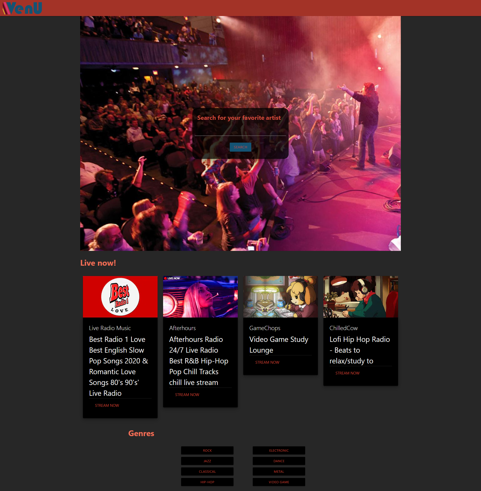
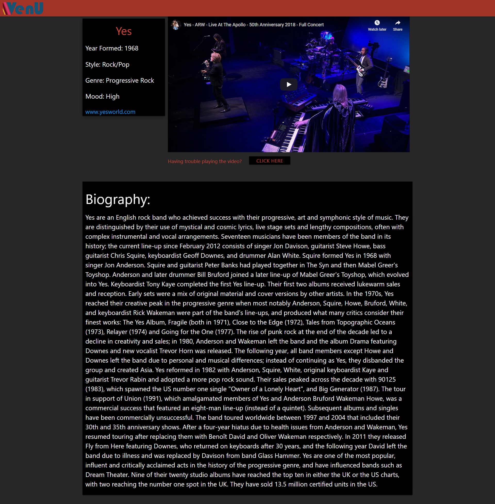

#   
livesite: https://ajm5099.github.io/Music-Discovery/  

### Authors: 
Alex Milroy  
github: https://github.com/ajm5099/

Evan Kirkland  
github: https://github.com/EvanK311/

Hao Guan  
github: https://github.com/devtown425/

David Guthmann  
github: https://github.com/Dguthmann/  

Christopher Wesonga  
github: https://github.com/ckomodo/

## List of Contents

index.html  
script.js  
style.css  
README.md  
screenshot1.png  
screenshot2.png  
venu-logo-large.png  
venu-logo.png  

## Basic Overview of Project
VenU is a music-discovery website for fans of live music, for fans to discover new artists and shows.  The search functionality allows you to search for a band and retrieve a performance by said band for the user to enjoy.  There is also currently live broadcasts for the user to browse. In addition as a starting point there are several genres for a new user to experience what certain genres have to offer in musical styling and feeling.  The videos displayed on site are populated with information about the bands provided by the AudioDB API when available.

## User Stories
AS A person who cannot attend local shows  
I WANT want to watch recorded concerts and shows at home  
AS A person wanting to find my favorite artist  
I WANT to be able to search for that band  
SO THAT I can watch them  
AS A person who is checking out a new band  
I WANT to be able to see information about them  
SO THAT I can learn about them  

## Screenshot of Website

## Resources Used

Joe Rehfuss for aid in project structure. In addition, curation of focus and project direction.  
Dennis Molloy for help with git merging errors and branch use.  A measured and patient approach to instill basics on team git development.  
Joanna Preston for help with materialize syntax and suggestions, and an extra set of eyes when working on debugging a functionality.  
Aslan Ghodsian help with responsive styling for a more optimized mobile and small screen user experience.  
CBC News for information on classical pieces for the genre button.  The full article is below.  
https://www.cbc.ca/music/read/10-pieces-of-classical-music-everyone-should-know-1.4995342

## Further Development Plans

The other suggestion panel was the last main functionality that was desired to add. The youtube api has a different professional aplication of the api but was more prohibitive due to music law and licensing, as the holder would need noted use and a parent organization.  This is more difficult to obtain for a short duration time framed student project.  It also required a designated domain which the team did not have as the site is deployed through gitpages.  For these reasons the desired suggestion functionality and some of the other features of this project are limited by the free youtube api license.
Competitor apis have a monthly fee and again more prohibitive on the short term student project format for this design meant to showcase ability to create.

## Changelog

2020-09-26: Add fix nav bar layout to reflect current build, add click functionality of home button, creation and writing of readme, create presentation documents.  
2020-09-25: Find working videos for embedding and artist info for each genre tag,  Create objects for live now objects and genre buttons,  Add functionality of trouble loading video, ajax requests for the genre buttons, add functionality to fill information for genre buttons, styling of trouble button area, styling and size of live cards, adjust size of artist information section, work on screen size accessability.  
2020-09-24: Build live now cards in html, Build artist information in js, Develop psuedocode of final styling of each major element and feature.  
2020-09-23: Search Button Functionality, Testing of search button, Test Writing to Iframe, Build title area for media player page, Test Seach Functionality for transition, CSS styling of search container, Building of genre buttons in html.  
2020-09-22: Creation of basic file structure, Add search bar to index, Add hero image to splash-page and styling, Build Artist information cards in html, Add a video frame and div to html page, Link up index to the js and css files, Add and test youtube api ajax requests, Add protecting settings to github repo.  
2020-09-19: Basic concept and brain storming session to come up with the concept that would be named VenU.  